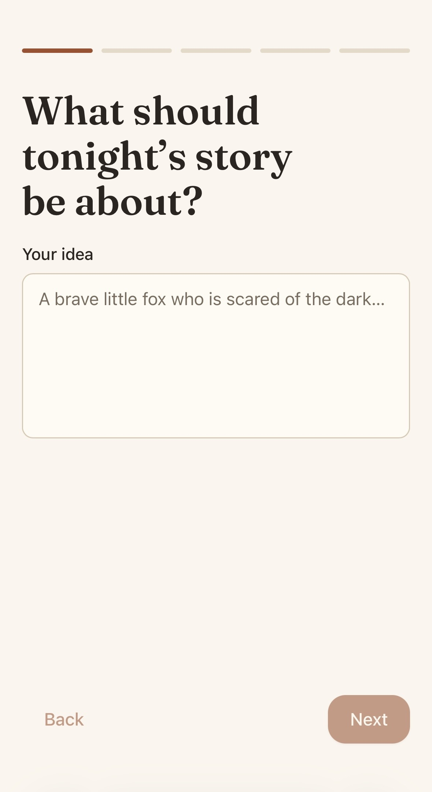
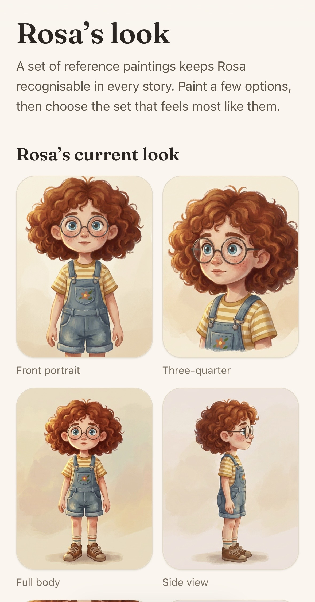
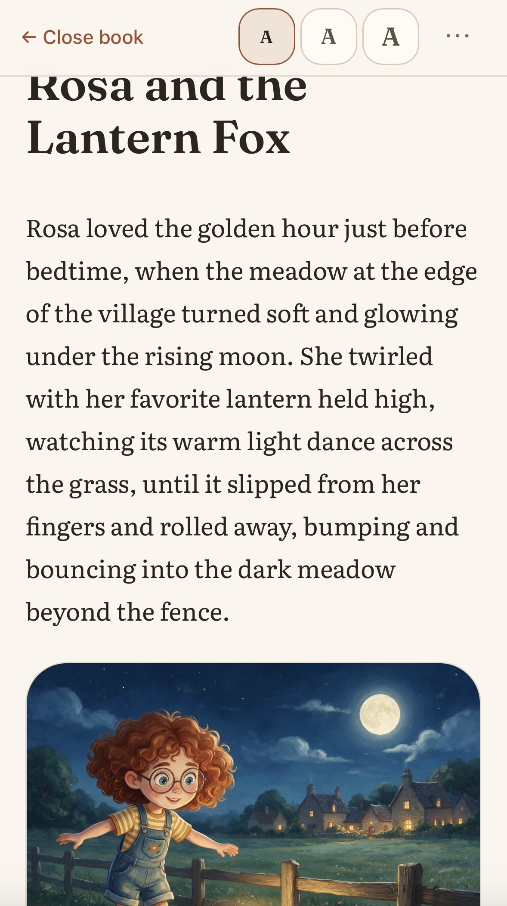

# Storylight

Storylight is a mobile-first application for creating personalised, illustrated bedtime stories with persistent characters, planned story arcs, and continuity that survives across chapters.

The core product idea is simple: **AI should disappear behind the reading experience.** Storylight is designed to feel like a small premium children's publishing system rather than an AI chat interface.

## Product flow

From a simple bedtime idea, Storylight builds a persistent visual identity and carries it into the finished illustrated story.

### 1. Start with an idea

<a href="docs/screenshots/IMG_1467.jpeg">
  
</a>

Storylight begins with a guided prompt rather than a chat interface, helping shape the story before generation begins.

### 2. Keep characters recognisable

<a href="docs/screenshots/IMG_1471.jpeg">
  
</a>

Recurring characters use approved reference artwork so later image generation can preserve identity across scenes and stories. Reference sets are approved, versioned, and used to condition subsequent generations rather than relying on prompt-only descriptions.

### 3. Read the finished story

<a href="docs/screenshots/IMG_1472.jpeg">
  
</a>

The finished experience is designed to feel like a polished illustrated reader rather than an AI tool.

## Why I built this

Storylight started with bedtime stories for my kids.

I was using ChatGPT to create them, but I kept running into the same problems: characters would gradually change, illustrations would stop looking like the same people, details from earlier parts of the story would be forgotten, and it was difficult to continue a story naturally over several nights.

I wanted something where a character created tonight could still look, speak, and behave like themselves next week — and where an ongoing story could build on what had already happened rather than starting from a fresh prompt every time.

That simple problem led to the more interesting engineering work behind Storylight: persistent canonical state, character reference sets, continuity rules, versioned prompts and models, reference-conditioned image generation, multimodal review, and immutable published chapters.

The goal is for the AI to disappear behind the experience. It should feel like returning to the same book and the same characters, not starting another chat session.

## The interesting engineering problem

Generating one story or one image is comparatively easy. Maintaining a coherent illustrated series is not.

Storylight treats continuity, character identity, model behaviour, and publication state as explicit engineering concerns:

- series are planned before Chapter 1 is generated
- canonical story state lives in Postgres, never in chat history
- model outputs are schema-validated and domain-validated before they can affect state
- published chapters and illustrations are immutable revisions
- recurring characters use approved reference assets rather than prompt-only descriptions
- illustration generation is reference-conditioned and followed by multimodal review
- prompt, schema, model-route, and visual-profile versions can be pinned per series so an infrastructure/model change does not silently alter an existing story
- provider-specific SDKs are isolated behind application-owned adapters

## Generation pipeline

A simplified story/illustration flow looks like this:

```text
Parent idea
    ↓
Structured story/series plan
    ↓
Validated canonical story state
    ↓
Chapter generation
    ↓
Character + scene specification
    ↓
Reference-conditioned image generation
    ↓
Vision review / repair / escalation
    ↓
Immutable approved publication
```

The implementation deliberately separates **model suggestion** from **canonical state transitions**. Models can propose content; deterministic application code decides whether that content is valid and may be persisted.

## AI systems work

Storylight is also a sandbox for production-minded AI engineering rather than just prompt experimentation. The repository includes work around:

- capability-based model routing through Vercel AI Gateway
- independent language, image-generation, and vision-review routes
- versioned prompts, schemas, model routes, and visual profiles
- model-route provenance on generated assets
- per-series route pinning for visual continuity
- structured output with defensive parsing/failure handling
- reference-image conditioning for stable character identity
- automated multimodal review and repair paths
- eval/probe tooling for testing model behaviour before changing production routes
- explicit cost bookkeeping and lower-cost model substitution where quality permits
- deterministic fake model adapters so CI/E2E does not depend on paid model calls

## Stack

- **Framework:** Next.js 16 App Router + React 19
- **Language:** TypeScript
- **AI:** Vercel AI SDK + AI Gateway
- **Workflows:** Vercel Workflow
- **Database:** Postgres + Drizzle ORM
- **Storage:** Vercel Blob / private object storage abstraction
- **Auth:** Better Auth
- **Validation:** Zod
- **Testing:** Vitest, Playwright, Storybook browser tests
- **UI:** Tailwind CSS

## Engineering approach

This project is built heavily with AI-assisted engineering, including coding agents. That is intentional: the interesting part is not whether an agent can emit code, but how the surrounding system constrains and verifies it.

The repository therefore keeps explicit project invariants in `AGENTS.md`, architecture decisions in `docs/decisions/`, and treats tests, migrations, evals, and typed/domain boundaries as the authority over generated implementation.

Some of the rules enforced by the project include:

- models never write directly to canonical state
- provider calls stay outside domain/frontend code
- existing series do not silently change model or visual-profile versions
- wrong child identity is a blocking image-review failure
- rejected content is never returned by reader APIs
- changes to canonical transitions require appropriate tests

See [`AGENTS.md`](AGENTS.md) and [`docs/README.md`](docs/README.md) for the detailed architecture and documentation map.

## Local development

### Requirements

- Node.js 22+
- pnpm
- Postgres
- a Vercel AI Gateway key for real model calls
- Vercel Blob credentials when using remote object storage

### Setup

```bash
pnpm install
cp .env.example .env.local
pnpm dev
```

Environment variables are documented in [`.env.example`](.env.example). Local/test infrastructure can use the repository's development fallbacks where applicable.

### Quality checks

```bash
pnpm typecheck
pnpm lint
pnpm format:check
pnpm test
pnpm test:e2e
pnpm build
pnpm db:validate
pnpm db:check
```

Additional model evaluation/probe tooling is available through the repository scripts.

## Documentation

The detailed design is intentionally kept in source control. Useful starting points:

- [`docs/01-product/vision.md`](docs/01-product/vision.md) — product intent
- [`docs/02-storytelling/continuity.md`](docs/02-storytelling/continuity.md) — canonical continuity model
- [`docs/03-ai/orchestration.md`](docs/03-ai/orchestration.md) — model orchestration
- [`docs/03-ai/image-generation.md`](docs/03-ai/image-generation.md) — illustration pipeline
- [`docs/03-ai/evaluation.md`](docs/03-ai/evaluation.md) — evaluation approach
- [`docs/decisions/`](docs/decisions/) — architecture decision records

## Status

Storylight is an actively developed personal project. It is shared publicly as a portfolio/engineering project; production family data, credentials, and private generated assets are not part of the repository.
